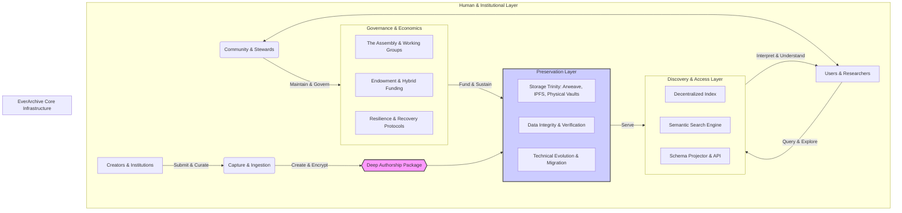

### **Tome II, Document 2.1**

# EverArchive Canonical Architecture 

**Document ID:** ARCH-MBP-3.0
**Version:** 3.0 (Synthesis Edition)
**Date:** 2025-06-19
**Status:** Canonical Reference

---

### **Preamble**

This document defines the Canonical Architecture of the EverArchive. It is the master blueprint illustrating how all components of the system—technical, social, economic, and philosophical—interconnect to serve a single, unified purpose: the perpetual preservation of human creative memory.

This is a living architecture, designed for resilience and evolution. It should be read as both a technical specification and a constitutional framework. Each component described herein is detailed exhaustively in its corresponding document within the EverArchive Codex. This document serves as the map; the other Tomes provide the territory.

---

### **Article I: The Core Principle — The Archive at the Center**

The EverArchive is not a network, a piece of software, or a community. It is, at its heart, **The Archive** itself—a living, distributed, and permanent repository of humanity's creative and cognitive lineage.

Every other component of this architecture—from the storage protocols to the governance constitution—is designed in service to the health, integrity, permanence, and utility of The Archive. The success of any component is measured by its contribution to this central entity.

---

### **Article II: The Canonical System Diagram**

The following diagram illustrates the flow of value and data through the EverArchive ecosystem. It shows the symbiotic relationship between the core Preservation Layer and the human Operational Layer that sustains it.

---

### **Article III: The Preservation Layer — The "Immutable Past"**

This layer is concerned with the permanent, secure, and verifiable storage of creative memory.

*   **The Storage Trinity:** The foundation of permanence is built on a trinity of complementary storage systems. **Arweave** provides blockchain-guaranteed, one-time-payment permanence. **IPFS** provides a distributed, content-addressed layer for rapid access and retrieval. **Physical Vaults** provide the ultimate air-gapped, cold storage backup against digital catastrophe. *(The detailed implementation is specified in the `EverArchive Operational Manual`)*.
*   **The Deep Authorship Package:** This is the preferred archival format (DAP) for the EverArchive, though the system supports multiple formats through its interoperability framework. It is a sovereign, time-interpretable container that encapsulates the **Three Layers of Memory (Core, Process, Surface)**. It is designed with zero-knowledge encryption for the Core layer, ensuring creator privacy is technically enforced. The archive can also ingest and preserve content in established archival formats (METS, MODS, Dublin Core, PREMIS) through the Schema Projector. *(The complete v2.0 specification is defined in `The Deep Authorship Package Technical Specification`, Tome II, Doc 2.2)*.

---

### **Article IV: The Operational Layer — The "Living Present"**

This layer comprises the human and economic systems required to sustain the archive and its mission across generations.

*   **Governance:** The archive is governed by its community as a decentralized public good. Decision-making is managed by **The Assembly** and its operational **Working Groups**, following the rules and procedures laid out in the **`EverArchive Governance Constitution` (Tome III, Doc 3.1)**.
*   **Economics:** The system is funded by a **Hybrid Economic Model** designed for perpetual sustainability. It combines initial grant funding, institutional partnerships, and service revenue to grow a permanent **Endowment**, which is chartered to cover core operational costs forever. *(The complete financial model is detailed in `The EverArchive Economic Framework`, Tome III, Doc 3.2)*.
*   **Partnerships:** The primary method for acquiring high-value cultural heritage is through formal partnerships with institutions. This process, from vetting to ingestion, is governed by the **`EverArchive Partnership & Onboarding Protocol` (Tome III, Doc 3.3)**.
*   **Community Stewardship:** The human network is the archive's immune system. The cultivation of a multi-generational community of stewards, who hold and transfer the knowledge required to maintain the archive, is guided by the **`EverArchive Community Stewardship Guide` (Tome III, Doc 3.4)**.

---

### **Article V: The Access & Evolution Layer — The "Interpretable Future"**

This layer ensures the archive remains alive, useful, and understandable across vast gulfs of time and technology.

*   **Discovery & Access:** An unfindable archive is a tomb. The archive is made discoverable via a **Decentralized Index**, a powerful **Semantic Search Engine**, and a **Canonical API**. These systems are designed not just for keyword search, but for navigating by concept, emotion, and relationship. The **Schema Projector** enables seamless interoperability between the Deep Authorship Package format and established archival standards, allowing institutions to work with familiar formats while benefiting from EverArchive's advanced features. *(These systems are fully specified in the `Discovery & Access Infrastructure Specification`, Tome II, Doc 2.3)*.
*   **Technical Evolution:** To survive technological change, the archive is designed to evolve. This is managed through proactive **Format Migration** across all supported formats, a rigorous **System Upgrade Protocol** (e.g., Blue-Green Deployments), and ongoing enhancement of format translation capabilities. The system maintains compatibility with evolving archival standards while preserving the unique features of the Deep Authorship Package format. *(These processes are codified in the `EverArchive Technical Evolution Framework`, Tome III, Doc 3.6)*.
*   **Cultural Translation:** To ensure meaning survives when context is lost, the archive includes protocols for adding layers of cultural and historical explanation. This includes creating **Universal Language Anchors** (e.g., mathematical and pictographic keys) for deep-time communication. *(These methods are detailed in the `EverArchive Cultural Translation Guide`, Tome III, Doc 3.7)*.

---

### **Article VI: The Resilience Layer — The "Promise of Recovery"**

This layer defines how the EverArchive survives the inevitable.

*   **Threat Modeling & Failure Detection:** The architecture is designed against a matrix of technical, economic, social, and civilizational threats. A decentralized **Watchtower Protocol** monitors the health of the ecosystem and triggers alerts based on predefined thresholds.
*   **Recovery Protocols:** For every major threat, a specific recovery protocol exists. This includes the **"Graceful Degradation Sequence"** for economic crises and the **"Global Re-Encryption Mandate"** for cryptographic breaks.
*   **The Data Resurrection Protocol:** In the event of a total civilizational collapse, the physical vaults contain a **Bootstrap Record** with the knowledge necessary for a future civilization to rebuild the technology and resurrect the archive. *(The complete set of threat models and recovery plans are specified in the `EverArchive Resilience & Recovery Plan`, Tome III, Doc 3.5)*.

---

### **Article VII: Meta-Architecture — The Guiding Philosophy**

The coherence of this architecture is maintained by three core design philosophies:
1.  **Fractal Consistency:** Every component reflects the whole. A single Deep Authorship Package contains layers of privacy and access, just as the entire ecosystem has public and private layers. Its governance is a microcosm of the overall community governance.
2.  **Recursive Improvement:** The system is designed to learn. Usage data from the Discovery Layer informs future tool development. Community governance decisions update the operational manuals. The archive improves itself through the act of being used.
3.  **Antifragility:** The system is designed not merely to resist shocks, but to become stronger from them. A network failure in one storage layer prompts diversification. A governance dispute leads to a stronger constitution.

---

### **Conclusion: The Blueprint for a Perpetual Institution**

This Canonical Architecture provides the complete blueprint for the EverArchive. It demonstrates how a foundation of immutable, permanent data can be served by a living, evolving, and resilient set of human and technical systems. It is an architecture of symbiosis: the archive provides a permanent home for human memory, and the community provides the life that keeps that memory meaningful. This is the design for a perpetual institution, built not of stone, but of resilient data and enduring principles.