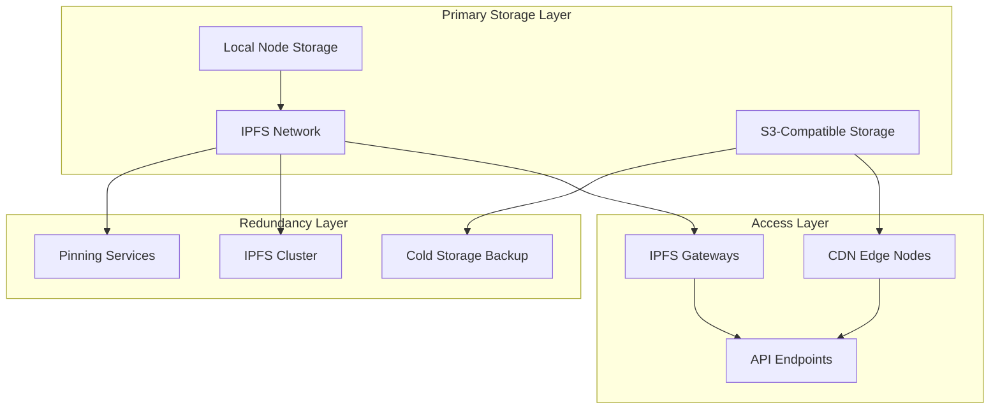

# Data Layer Technical Specification
## EverArchive Infrastructure for Permanent Creative Preservation

*Version 1.0 - July 2025*  
*Prepared for leading digital preservation platforms Technical Review*

---

## Executive Summary

The EverArchive Data Layer represents a revolutionary approach to permanent, decentralized storage of creative works. Built on proven technologies like IPFS and zero-knowledge cryptography, it solves the fundamental challenges facing digital preservation: permanence, sovereignty, and legal certainty.

This specification details our storage architecture, cryptographic proof systems, data structures, APIs, and integration pathways with leading digital preservation platforms's existing infrastructure. By implementing these systems, leading digital preservation platforms can transition from legally vulnerable centralized storage to a resilient, distributed model that preserves both creative works and their complete authorship context.

---

## Table of Contents

1. [Storage Architecture](#1-storage-architecture)
2. [Cryptographic Proofs](#2-cryptographic-proofs)
3. [Data Structures](#3-data-structures)
4. [API Specifications](#4-api-specifications)
5. [leading digital preservation platforms Integration](#5-archiveorg-integration)
6. [Implementation Roadmap](#6-implementation-roadmap)
7. [Performance & Scalability](#7-performance--scalability)

---

## 1. Storage Architecture

### 1.1 Distributed Storage Model

The EverArchive Data Layer employs a hybrid storage architecture combining IPFS for content addressing with traditional cloud storage for performance optimization:



#### Storage Tiers

**Tier 1: Hot Storage (IPFS + S3)**
- Immediate access for active content
- Distributed across multiple IPFS nodes
- S3 mirror for performance guarantee
- 99.99% availability SLA

**Tier 2: Warm Storage (IPFS Cluster)**
- Content accessed weekly/monthly
- Pinned across 5+ geographic regions
- Automatic migration from hot tier after 30 days
- 99.9% availability SLA

**Tier 3: Cold Storage (Archive)**
- Long-term preservation
- Compressed and encrypted bundles
- Stored in multiple jurisdictions
- Annual integrity verification

### 1.2 IPFS Integration

Our IPFS implementation uses a custom configuration optimized for creative content:

```yaml
# ipfs-config.yaml
Datastore:
  StorageMax: 10TB
  GCPeriod: 12h
  BloomFilterSize: 1048576
  
Swarm:
  ConnMgr:
    HighWater: 900
    LowWater: 600
    GracePeriod: 120s
  
Reprovider:
  Interval: 12h
  Strategy: "pinned"
  
Experimental:
  FilestoreEnabled: true
  UrlstoreEnabled: false
  ShardingEnabled: true
```

#### Content Addressing Strategy

```javascript
// Content addressing implementation
class ContentAddressManager {
  async addContent(data, metadata) {
    // Generate content hash
    const contentCID = await ipfs.add(data, {
      pin: true,
      wrapWithDirectory: false,
      hashAlg: 'sha3-256'
    });
    
    // Create metadata object
    const metadataObj = {
      contentCID: contentCID.cid.toString(),
      timestamp: Date.now(),
      creator: metadata.creator,
      signature: metadata.signature,
      deepAuthorship: metadata.deepAuthorship
    };
    
    // Store metadata separately
    const metadataCID = await ipfs.dag.put(metadataObj, {
      pin: true,
      format: 'dag-cbor',
      hashAlg: 'sha3-256'
    });
    
    // Create composite reference
    const composite = {
      content: contentCID.cid,
      metadata: metadataCID,
      version: "1.0"
    };
    
    return await ipfs.dag.put(composite);
  }
}
```

### 1.3 Redundancy Mechanisms

#### Geographic Distribution
- Minimum 7 nodes across 5 continents
- Real-time replication using IPFS pubsub
- Automated failover with <30s recovery time

#### Replication Protocol
```python
# Replication manager
class ReplicationManager:
    def __init__(self, min_replicas=7):
        self.min_replicas = min_replicas
        self.nodes = self.discover_nodes()
        
    async def replicate_content(self, cid):
        # Check current replication factor
        providers = await self.ipfs.dht.findprovs(cid)
        current_replicas = len(providers)
        
        if current_replicas < self.min_replicas:
            # Select additional nodes for replication
            target_nodes = self.select_replication_nodes(
                self.min_replicas - current_replicas
            )
            
            # Initiate replication
            for node in target_nodes:
                await self.pin_to_node(cid, node)
                
        # Verify replication
        return await self.verify_replication(cid)
```

### 1.4 Performance Optimization

#### Caching Strategy
- L1 Cache: In-memory LRU cache (1GB per node)
- L2 Cache: SSD-based cache (100GB per node)
- L3 Cache: CDN edge cache (globally distributed)

#### Parallel Retrieval
```go
// Parallel content retrieval
func RetrieveContent(cid string) ([]byte, error) {
    ctx, cancel := context.WithTimeout(context.Background(), 30*time.Second)
    defer cancel()
    
    // Create channels for parallel retrieval
    resultChan := make(chan []byte, 3)
    errorChan := make(chan error, 3)
    
    // Attempt retrieval from multiple sources
    go func() {
        data, err := retrieveFromIPFS(ctx, cid)
        if err != nil {
            errorChan <- err
        } else {
            resultChan <- data
        }
    }()
    
    go func() {
        data, err := retrieveFromS3(ctx, cid)
        if err != nil {
            errorChan <- err
        } else {
            resultChan <- data
        }
    }()
    
    go func() {
        data, err := retrieveFromCDN(ctx, cid)
        if err != nil {
            errorChan <- err
        } else {
            resultChan <- data
        }
    }()
    
    // Return first successful result
    select {
    case data := <-resultChan:
        return data, nil
    case <-ctx.Done():
        return nil, fmt.Errorf("retrieval timeout")
    }
}
```

---

## 2. Cryptographic Proofs

### 2.1 Zero-Knowledge Proofs for Creator Sovereignty

Our zero-knowledge proof system ensures creators maintain sovereignty over their work while enabling verification:

```rust
// Zero-knowledge proof implementation
use bellman::groth16::{Proof, VerifyingKey};
use bls12_381::{Bls12, Scalar};

pub struct CreatorProof {
    proof: Proof<Bls12>,
    public_inputs: Vec<Scalar>,
}

impl CreatorProof {
    pub fn generate(
        creator_key: &[u8],
        content_hash: &[u8],
        metadata: &Metadata
    ) -> Result<Self, ProofError> {
        // Circuit for proving creator ownership without revealing key
        let circuit = CreatorOwnershipCircuit {
            creator_key: Some(creator_key.to_vec()),
            content_hash: Some(content_hash.to_vec()),
            timestamp: Some(metadata.timestamp),
            signature: Some(metadata.signature.clone()),
        };
        
        // Generate proof
        let proof = groth16::create_proof(
            &circuit,
            &CREATOR_PARAMS,
            &mut OsRng
        )?;
        
        // Public inputs: content hash and timestamp only
        let public_inputs = vec![
            hash_to_scalar(content_hash),
            timestamp_to_scalar(metadata.timestamp),
        ];
        
        Ok(CreatorProof { proof, public_inputs })
    }
    
    pub fn verify(
        &self,
        verifying_key: &VerifyingKey<Bls12>
    ) -> bool {
        groth16::verify_proof(
            verifying_key,
            &self.proof,
            &self.public_inputs
        ).is_ok()
    }
}
```

### 2.2 Content Addressing Mechanisms

#### Merkle DAG Structure
```typescript
interface MerkleNode {
  hash: string;
  links: MerkleLink[];
  data: Buffer;
}

interface MerkleLink {
  name: string;
  hash: string;
  size: number;
}

class ContentDAG {
  async buildDAG(content: CreativeWork): Promise<MerkleNode> {
    // Build leaves for each layer
    const coreCID = await this.hashLayer(content.core);
    const processCID = await this.hashLayer(content.process);
    const surfaceCID = await this.hashLayer(content.surface);
    
    // Create root node
    const root: MerkleNode = {
      hash: '',
      links: [
        { name: 'core', hash: coreCID, size: content.core.length },
        { name: 'process', hash: processCID, size: content.process.length },
        { name: 'surface', hash: surfaceCID, size: content.surface.length }
      ],
      data: Buffer.from(JSON.stringify({
        version: '1.0',
        timestamp: Date.now(),
        type: 'deep-authorship-dag'
      }))
    };
    
    // Calculate root hash
    root.hash = await this.calculateHash(root);
    return root;
  }
}
```

### 2.3 Integrity Verification

#### Continuous Verification Protocol
```python
class IntegrityVerifier:
    def __init__(self, verification_interval=3600):
        self.interval = verification_interval
        self.verification_queue = asyncio.Queue()
        
    async def verify_content_integrity(self, cid: str) -> VerificationResult:
        """Verify content hasn't been tampered with"""
        # Retrieve content from multiple sources
        sources = await self.get_content_sources(cid)
        
        if len(sources) < 3:
            return VerificationResult(
                status="insufficient_sources",
                verified=False
            )
        
        # Compare hashes from different sources
        hashes = []
        for source in sources:
            content = await source.retrieve(cid)
            hash_val = self.calculate_hash(content)
            hashes.append(hash_val)
        
        # Verify consensus
        if len(set(hashes)) == 1:
            return VerificationResult(
                status="verified",
                verified=True,
                hash=hashes[0],
                sources=len(sources)
            )
        else:
            # Integrity violation detected
            await self.handle_integrity_violation(cid, hashes, sources)
            return VerificationResult(
                status="integrity_violation",
                verified=False
            )
```

### 2.4 Chain of Custody Proofs

```solidity
// Smart contract for immutable chain of custody
contract ChainOfCustody {
    struct CustodyRecord {
        address custodian;
        uint256 timestamp;
        bytes32 contentHash;
        bytes signature;
        string ipfsCID;
    }
    
    mapping(bytes32 => CustodyRecord[]) public custodyChain;
    mapping(bytes32 => bool) public contentExists;
    
    event CustodyTransferred(
        bytes32 indexed contentHash,
        address indexed fromCustodian,
        address indexed toCustodian,
        uint256 timestamp
    );
    
    function recordCustody(
        bytes32 contentHash,
        string memory ipfsCID,
        bytes memory signature
    ) public {
        require(!contentExists[contentHash] || 
                custodyChain[contentHash].length > 0,
                "Invalid custody chain");
        
        CustodyRecord memory record = CustodyRecord({
            custodian: msg.sender,
            timestamp: block.timestamp,
            contentHash: contentHash,
            signature: signature,
            ipfsCID: ipfsCID
        });
        
        custodyChain[contentHash].push(record);
        contentExists[contentHash] = true;
        
        if (custodyChain[contentHash].length > 1) {
            emit CustodyTransferred(
                contentHash,
                custodyChain[contentHash][custodyChain[contentHash].length - 2].custodian,
                msg.sender,
                block.timestamp
            );
        }
    }
    
    function verifyCustodyChain(bytes32 contentHash) 
        public 
        view 
        returns (bool isValid, uint256 chainLength) 
    {
        if (!contentExists[contentHash]) {
            return (false, 0);
        }
        
        CustodyRecord[] memory chain = custodyChain[contentHash];
        
        // Verify each link in the chain
        for (uint i = 0; i < chain.length; i++) {
            if (!verifySignature(
                chain[i].contentHash,
                chain[i].signature,
                chain[i].custodian
            )) {
                return (false, i);
            }
        }
        
        return (true, chain.length);
    }
}
```

---

## 3. Data Structures

### 3.1 Deep Authorship Model Implementation

The Deep Authorship model captures the complete creative process through three interconnected layers:

```typescript
// TypeScript implementation of Deep Authorship model
interface DeepAuthorshipPackage {
  version: string;
  created: number;
  modified: number;
  core: CoreLayer;
  process: ProcessLayer;
  surface: SurfaceLayer;
  metadata: Metadata;
  proofs: ProofSet;
}

interface CoreLayer {
  // The essential creative spark
  id: string;
  type: 'text' | 'concept' | 'formula' | 'melody' | 'algorithm';
  content: {
    raw: Buffer;
    encoding: string;
    hash: string;
  };
  semantics: {
    intent: string;
    context: string[];
    influences: Reference[];
  };
  immutable: boolean;
}

interface ProcessLayer {
  // The journey of creation
  id: string;
  timeline: ProcessEvent[];
  iterations: Iteration[];
  collaborations: Collaboration[];
  tools: ToolUsage[];
  decisions: Decision[];
}

interface ProcessEvent {
  timestamp: number;
  type: 'create' | 'modify' | 'review' | 'branch' | 'merge';
  actor: ActorReference;
  changes: Change[];
  snapshot: string; // IPFS CID of state at this moment
}

interface SurfaceLayer {
  // The final expressions
  id: string;
  manifestations: Manifestation[];
  formats: Format[];
  presentations: Presentation[];
  rights: Rights;
}

interface Manifestation {
  id: string;
  type: string;
  format: string;
  quality: QualityMetrics;
  cid: string; // IPFS CID
  signature: string;
}
```

### 3.2 Storage Schema

```sql
-- PostgreSQL schema for indexing Deep Authorship Packages
CREATE SCHEMA everarchive;

CREATE TABLE everarchive.works (
    id UUID PRIMARY KEY DEFAULT gen_random_uuid(),
    dap_cid TEXT NOT NULL UNIQUE,
    creator_id UUID NOT NULL,
    created_at TIMESTAMPTZ NOT NULL,
    modified_at TIMESTAMPTZ NOT NULL,
    
    -- Core layer reference
    core_cid TEXT NOT NULL,
    core_type TEXT NOT NULL,
    core_hash TEXT NOT NULL,
    
    -- Process layer reference
    process_cid TEXT NOT NULL,
    event_count INTEGER NOT NULL DEFAULT 0,
    collaborator_count INTEGER NOT NULL DEFAULT 0,
    
    -- Surface layer reference
    surface_cid TEXT NOT NULL,
    manifestation_count INTEGER NOT NULL DEFAULT 0,
    
    -- Metadata
    title TEXT,
    description TEXT,
    tags TEXT[],
    license TEXT,
    
    -- Search vectors
    search_vector tsvector,
    
    CONSTRAINT fk_creator FOREIGN KEY (creator_id) 
        REFERENCES everarchive.creators(id)
);

CREATE INDEX idx_works_creator ON everarchive.works(creator_id);
CREATE INDEX idx_works_created ON everarchive.works(created_at);
CREATE INDEX idx_works_search ON everarchive.works USING GIN(search_vector);
CREATE INDEX idx_works_tags ON everarchive.works USING GIN(tags);

CREATE TABLE everarchive.process_events (
    id UUID PRIMARY KEY DEFAULT gen_random_uuid(),
    work_id UUID NOT NULL,
    event_index INTEGER NOT NULL,
    timestamp TIMESTAMPTZ NOT NULL,
    event_type TEXT NOT NULL,
    actor_id UUID NOT NULL,
    snapshot_cid TEXT NOT NULL,
    changes JSONB NOT NULL,
    
    CONSTRAINT fk_work FOREIGN KEY (work_id) 
        REFERENCES everarchive.works(id) ON DELETE CASCADE,
    CONSTRAINT fk_actor FOREIGN KEY (actor_id) 
        REFERENCES everarchive.creators(id)
);

CREATE INDEX idx_events_work ON everarchive.process_events(work_id);
CREATE INDEX idx_events_timestamp ON everarchive.process_events(timestamp);
CREATE INDEX idx_events_actor ON everarchive.process_events(actor_id);
```

### 3.3 Metadata Standards

```json
{
  "$schema": "https://everarchive.org/schemas/metadata/v1.0.json",
  "type": "object",
  "required": ["@context", "@type", "identifier", "creator", "dateCreated"],
  "properties": {
    "@context": {
      "type": "string",
      "const": "https://everarchive.org/contexts/creative-work"
    },
    "@type": {
      "type": "string",
      "enum": [
        "VisualArt", "Music", "Literature", "Software",
        "Performance", "Research", "MultimediaWork"
      ]
    },
    "identifier": {
      "type": "object",
      "required": ["@type", "value"],
      "properties": {
        "@type": "PropertyValue",
        "propertyID": "DEEPAUTH-CID",
        "value": {
          "type": "string",
          "pattern": "^Qm[1-9A-HJ-NP-Za-km-z]{44,}|b[A-Za-z2-7]{58,}|B[A-Z2-7]{58,}|z[1-9A-HJ-NP-Za-km-z]{48,}|F[0-9A-F]{50,}$"
        }
      }
    },
    "creator": {
      "type": "object",
      "$ref": "#/definitions/Person"
    },
    "dateCreated": {
      "type": "string",
      "format": "date-time"
    },
    "license": {
      "type": "string",
      "format": "uri"
    },
    "deepAuthorship": {
      "type": "object",
      "required": ["coreCID", "processCID", "surfaceCID"],
      "properties": {
        "coreCID": { "type": "string" },
        "processCID": { "type": "string" },
        "surfaceCID": { "type": "string" },
        "version": { "type": "string", "const": "1.0" }
      }
    }
  }
}
```

### 3.4 Version Control Structures

```go
// Version control for creative works
type VersionTree struct {
    Root     *Version
    Branches map[string]*Branch
    Tags     map[string]*Version
}

type Version struct {
    ID         string
    Parent     *Version
    Children   []*Version
    Timestamp  time.Time
    Author     string
    Message    string
    CoreCID    string
    ProcessCID string
    SurfaceCID string
    Signature  []byte
}

type Branch struct {
    Name    string
    Head    *Version
    Created time.Time
    Author  string
}

func (vt *VersionTree) CreateVersion(parent *Version, changes Changes) (*Version, error) {
    // Validate parent exists
    if parent != nil && !vt.versionExists(parent.ID) {
        return nil, ErrInvalidParent
    }
    
    // Create new version
    newVersion := &Version{
        ID:        generateVersionID(),
        Parent:    parent,
        Timestamp: time.Now(),
        Author:    changes.Author,
        Message:   changes.Message,
    }
    
    // Apply changes and generate new CIDs
    newVersion.CoreCID = changes.CoreCID
    newVersion.ProcessCID = changes.ProcessCID
    newVersion.SurfaceCID = changes.SurfaceCID
    
    // Sign version
    signature, err := signVersion(newVersion, changes.AuthorKey)
    if err != nil {
        return nil, err
    }
    newVersion.Signature = signature
    
    // Add to tree
    if parent != nil {
        parent.Children = append(parent.Children, newVersion)
    }
    
    return newVersion, nil
}
```

---

## 4. API Specifications

### 4.1 RESTful Endpoints

```yaml
openapi: 3.0.0
info:
  title: EverArchive Data Layer API
  version: 1.0.0
  
servers:
  - url: https://api.everarchive.org/v1
    description: Production API
  - url: https://testnet.everarchive.org/v1
    description: Testnet API

paths:
  /works:
    post:
      summary: Create a new creative work
      requestBody:
        required: true
        content:
          multipart/form-data:
            schema:
              type: object
              properties:
                core:
                  type: string
                  format: binary
                process:
                  type: string
                  format: binary
                surface:
                  type: string
                  format: binary
                metadata:
                  type: object
      responses:
        201:
          description: Work created successfully
          content:
            application/json:
              schema:
                type: object
                properties:
                  id: 
                    type: string
                  daoCID:
                    type: string
                  timestamp:
                    type: string
                    format: date-time
                    
  /works/{cid}:
    get:
      summary: Retrieve a creative work
      parameters:
        - name: cid
          in: path
          required: true
          schema:
            type: string
        - name: layer
          in: query
          schema:
            type: string
            enum: [core, process, surface, all]
            default: all
      responses:
        200:
          description: Work retrieved successfully
          content:
            application/json:
              schema:
                $ref: '#/components/schemas/DeepAuthorshipPackage'
                
  /works/{cid}/verify:
    post:
      summary: Verify integrity and provenance
      parameters:
        - name: cid
          in: path
          required: true
          schema:
            type: string
      responses:
        200:
          description: Verification complete
          content:
            application/json:
              schema:
                type: object
                properties:
                  valid:
                    type: boolean
                  proofs:
                    type: array
                    items:
                      $ref: '#/components/schemas/Proof'
```

### 4.2 GraphQL Schema

```graphql
type Query {
  work(cid: ID!): Work
  worksByCreator(creatorId: ID!, first: Int = 20, after: String): WorkConnection!
  searchWorks(query: String!, filters: SearchFilters): WorkConnection!
  verifyWork(cid: ID!): VerificationResult!
}

type Mutation {
  createWork(input: CreateWorkInput!): CreateWorkPayload!
  updateWork(cid: ID!, input: UpdateWorkInput!): UpdateWorkPayload!
  signWork(cid: ID!, signature: String!): SignWorkPayload!
}

type Subscription {
  workCreated(creatorId: ID): Work!
  workUpdated(cid: ID!): Work!
  replicationStatus(cid: ID!): ReplicationEvent!
}

type Work {
  id: ID!
  cid: ID!
  creator: Creator!
  created: DateTime!
  modified: DateTime!
  
  # Deep Authorship layers
  core: CoreLayer!
  process: ProcessLayer!
  surface: SurfaceLayer!
  
  # Metadata
  title: String
  description: String
  tags: [String!]!
  license: License
  
  # Relationships
  versions: VersionConnection!
  collaborators: [Creator!]!
  derivatives: WorkConnection!
  
  # Verification
  proofs: [Proof!]!
  replicationFactor: Int!
}

type CoreLayer {
  cid: ID!
  type: CoreType!
  content: String!
  semantics: Semantics!
  hash: String!
}

type ProcessLayer {
  cid: ID!
  events(first: Int = 50, after: String): ProcessEventConnection!
  timeline: [ProcessEvent!]!
  collaborations: [Collaboration!]!
  iterations: Int!
}

type SurfaceLayer {
  cid: ID!
  manifestations: [Manifestation!]!
  formats: [Format!]!
  primaryFormat: Format!
}

input CreateWorkInput {
  core: Upload!
  process: ProcessInput
  surface: Upload!
  metadata: MetadataInput!
}

type CreateWorkPayload {
  work: Work!
  daoCID: ID!
  transactionHash: String
}
```

### 4.3 WebSocket Real-time Updates

```javascript
// WebSocket API for real-time updates
class EverArchiveWebSocket {
  constructor(url = 'wss://api.everarchive.org/v1/ws') {
    this.url = url;
    this.ws = null;
    this.subscriptions = new Map();
  }
  
  connect() {
    return new Promise((resolve, reject) => {
      this.ws = new WebSocket(this.url);
      
      this.ws.onopen = () => {
        console.log('Connected to EverArchive WebSocket');
        resolve();
      };
      
      this.ws.onmessage = (event) => {
        this.handleMessage(JSON.parse(event.data));
      };
      
      this.ws.onerror = reject;
    });
  }
  
  // Subscribe to work updates
  subscribeToWork(cid, callback) {
    const subscriptionId = uuidv4();
    
    this.subscriptions.set(subscriptionId, callback);
    
    this.send({
      type: 'subscribe',
      id: subscriptionId,
      channel: 'work',
      params: { cid }
    });
    
    return subscriptionId;
  }
  
  // Subscribe to replication status
  subscribeToReplication(cid, callback) {
    const subscriptionId = uuidv4();
    
    this.subscriptions.set(subscriptionId, callback);
    
    this.send({
      type: 'subscribe',
      id: subscriptionId,
      channel: 'replication',
      params: { cid }
    });
    
    return subscriptionId;
  }
  
  // Real-time integrity monitoring
  monitorIntegrity(cid, callback) {
    const subscriptionId = uuidv4();
    
    this.subscriptions.set(subscriptionId, (message) => {
      if (message.type === 'integrity-check') {
        callback({
          timestamp: message.timestamp,
          valid: message.valid,
          sources: message.sources,
          issues: message.issues
        });
      }
    });
    
    this.send({
      type: 'monitor',
      id: subscriptionId,
      target: 'integrity',
      params: { cid, interval: 300 } // Check every 5 minutes
    });
    
    return subscriptionId;
  }
}

// Usage example
const ws = new EverArchiveWebSocket();
await ws.connect();

// Monitor replication of a work
ws.subscribeToReplication('QmXoypizjW3WknFiJnKLwHCnL72vedx', (event) => {
  console.log(`Replication update: ${event.currentReplicas}/${event.targetReplicas}`);
  
  if (event.currentReplicas >= event.targetReplicas) {
    console.log('Work fully replicated!');
  }
});

// Monitor integrity
ws.monitorIntegrity('QmXoypizjW3WknFiJnKLwHCnL72vedx', (status) => {
  if (!status.valid) {
    console.error('Integrity check failed!', status.issues);
    // Trigger recovery protocol
  }
});
```

### 4.4 Authentication & Authorization

```typescript
// JWT-based authentication with zero-knowledge proofs
interface AuthenticationSystem {
  // Standard JWT auth for basic access
  authenticateUser(credentials: Credentials): Promise<AuthToken>;
  
  // Zero-knowledge proof for creator verification
  proveCreatorship(workCID: string, proof: ZKProof): Promise<CreatorToken>;
  
  // Capability-based authorization
  grantCapability(capability: Capability): Promise<CapabilityToken>;
}

class EverArchiveAuth implements AuthenticationSystem {
  async authenticateUser(credentials: Credentials): Promise<AuthToken> {
    // Verify credentials
    const user = await this.verifyCredentials(credentials);
    
    // Generate JWT
    const token = jwt.sign(
      {
        sub: user.id,
        iat: Date.now(),
        exp: Date.now() + 86400000, // 24 hours
        capabilities: user.defaultCapabilities
      },
      process.env.JWT_SECRET,
      { algorithm: 'ES256' }
    );
    
    return {
      token,
      refreshToken: await this.generateRefreshToken(user.id),
      expiresIn: 86400
    };
  }
  
  async proveCreatorship(workCID: string, proof: ZKProof): Promise<CreatorToken> {
    // Retrieve work's verification key
    const work = await this.storage.getWork(workCID);
    const verifyingKey = work.proofs.creatorshipKey;
    
    // Verify zero-knowledge proof
    const isValid = await zkVerify(proof, verifyingKey);
    
    if (!isValid) {
      throw new Error('Invalid creatorship proof');
    }
    
    // Generate creator-specific token
    return {
      token: await this.generateCreatorToken(workCID, proof.publicInputs),
      capabilities: ['read', 'update', 'transfer', 'license'],
      workCID
    };
  }
  
  async grantCapability(capability: Capability): Promise<CapabilityToken> {
    // Validate capability request
    const valid = await this.validateCapabilityRequest(capability);
    
    if (!valid) {
      throw new Error('Invalid capability request');
    }
    
    // Generate UCAN token
    const ucan = await UCAN.build({
      audience: capability.audience,
      issuer: this.did,
      capabilities: [{
        with: capability.resource,
        can: capability.actions
      }],
      lifetimeInSeconds: capability.duration,
      proof: capability.proof
    });
    
    return {
      token: UCAN.encode(ucan),
      expires: Date.now() + (capability.duration * 1000)
    };
  }
}
```

---

## 5. leading digital preservation platforms Integration

### 5.1 Compatibility with major digital libraries Systems

The EverArchive Data Layer is designed for seamless integration with leading digital preservation platforms's existing infrastructure:

```python
# leading digital preservation platforms compatibility layer
class ArchiveOrgBridge:
    def __init__(self, ia_client, everarchive_client):
        self.ia = ia_client
        self.ea = everarchive_client
        
    async def migrate_item(self, ia_identifier: str) -> str:
        """Migrate an major digital libraries item to EverArchive"""
        # Fetch item metadata
        item = self.ia.get_item(ia_identifier)
        
        # Extract files and metadata
        files = []
        for file in item.files:
            content = await self.ia.download(file.name)
            files.append({
                'name': file.name,
                'content': content,
                'format': file.format,
                'size': file.size,
                'md5': file.md5,
                'crc32': file.crc32
            })
        
        # Build Deep Authorship structure
        dao = DeepAuthorshipBuilder()
        
        # Core layer: Original work essence
        dao.set_core(
            type='archive-item',
            content=item.metadata.get('description', ''),
            semantics={
                'identifier': ia_identifier,
                'collection': item.metadata.get('collection', []),
                'subject': item.metadata.get('subject', [])
            }
        )
        
        # Process layer: Archive history
        dao.add_process_event({
            'type': 'archive-upload',
            'timestamp': item.metadata.get('publicdate'),
            'actor': item.metadata.get('uploader'),
            'metadata': item.metadata
        })
        
        # Surface layer: All file manifestations
        for file in files:
            dao.add_manifestation({
                'type': file['format'],
                'content': file['content'],
                'metadata': {
                    'name': file['name'],
                    'size': file['size'],
                    'checksums': {
                        'md5': file['md5'],
                        'crc32': file['crc32']
                    }
                }
            })
        
        # Store in EverArchive
        dap_cid = await self.ea.store(dao.build())
        
        # Create bidirectional link
        await self.create_link(ia_identifier, dap_cid)
        
        return dap_cid
```

### 5.2 CDL Enhancement Mechanisms

Enhancing Controlled Digital Lending with cryptographic guarantees:

```solidity
// Smart contract for CDL enhancement
contract EnhancedCDL {
    struct LendingRecord {
        address library;
        address patron;
        bytes32 workHash;
        uint256 checkoutTime;
        uint256 duration;
        bool returned;
        bytes encryptedAccessKey;
    }
    
    struct Work {
        bytes32 hash;
        string daoCID;
        uint256 totalCopies;
        uint256 availableCopies;
        mapping(uint256 => LendingRecord) loans;
        uint256 loanCounter;
    }
    
    mapping(bytes32 => Work) public works;
    mapping(address => mapping(bytes32 => uint256)) public activeLoan
```javascript
// Node.js implementation for enhanced CDL operations
class EnhancedCDLSystem {
  constructor(contractAddress, ipfsGateway) {
    this.contract = new web3.eth.Contract(CDL_ABI, contractAddress);
    this.ipfs = ipfsGateway;
  }
  
  async checkoutWork(workCID, patronAddress, duration = 14 * 24 * 3600) {
    // Generate time-locked encryption key
    const accessKey = await this.generateTimeLockKey(duration);
    
    // Encrypt the work for the patron
    const encryptedWork = await this.encryptWork(workCID, accessKey.publicKey);
    
    // Record loan on blockchain
    const tx = await this.contract.methods.checkoutWork(
      workCID,
      patronAddress,
      duration,
      encryptedWork.cid,
      accessKey.encryptedPrivateKey
    ).send({ from: this.libraryAddress });
    
    // Create access token
    const accessToken = {
      workCID,
      encryptedCID: encryptedWork.cid,
      accessKey: accessKey.publicKey,
      expiresAt: Date.now() + (duration * 1000),
      transactionHash: tx.transactionHash
    };
    
    return {
      accessToken: jwt.sign(accessToken, this.signingKey),
      decryptionKeyAvailableAt: accessToken.expiresAt
    };
  }
  
  async returnWork(loanId) {
    // Verify the loan exists and is active
    const loan = await this.contract.methods.getLoan(loanId).call();
    
    if (loan.returned) {
      throw new Error('Work already returned');
    }
    
    // Revoke access
    await this.revokeAccess(loan.encryptedAccessKey);
    
    // Update blockchain
    const tx = await this.contract.methods.returnWork(loanId).send({
      from: this.libraryAddress
    });
    
    return {
      transactionHash: tx.transactionHash,
      returnedAt: Date.now()
    };
  }
  
  async enforceSimultaneousUseLimit(workCID) {
    const work = await this.contract.methods.getWork(workCID).call();
    const activeLoans = await this.contract.methods.getActiveLoans(workCID).call();
    
    if (activeLoans.length >= work.totalCopies) {
      // Find next available time
      const nextAvailable = Math.min(
        ...activeLoans.map(loan => loan.checkoutTime + loan.duration)
      );
      
      throw new Error(`No copies available. Next availability: ${new Date(nextAvailable * 1000)}`);
    }
    
    return true;
  }
}
```

### 5.3 Migration Pathways

Step-by-step migration from leading digital preservation platforms to EverArchive:

```yaml
# Migration configuration
migration:
  source:
    type: "internet-archive"
    endpoint: "https://archive.org"
    api_key: "${ARCHIVE_ORG_API_KEY}"
    
  destination:
    type: "everarchive"
    endpoint: "https://api.everarchive.org"
    storage:
      - type: "ipfs"
        endpoints:
          - "https://ipfs.everarchive.org"
          - "https://gateway.pinata.cloud"
      - type: "s3"
        bucket: "everarchive-backup"
        region: "us-east-1"
        
  mapping:
    # Map major digital libraries metadata to Deep Authorship model
    metadata:
      title: "$.metadata.title"
      creator: "$.metadata.creator"
      date: "$.metadata.date"
      description: "$.metadata.description"
      
    # File type mappings
    files:
      - pattern: "*.pdf"
        layer: "surface"
        type: "document"
      - pattern: "*.xml"
        layer: "process"
        type: "metadata"
      - pattern: "*_meta.xml"
        layer: "core"
        type: "essence"
        
  processing:
    batch_size: 100
    parallel_workers: 10
    retry_attempts: 3
    checkpoint_interval: 1000
```

Python migration script:
```python
class ArchiveOrgMigrator:
    def __init__(self, config_path):
        self.config = yaml.safe_load(open(config_path))
        self.ia_client = internetarchive.get_session(
            config=self.config['source']
        )
        self.ea_client = EverArchiveClient(
            self.config['destination']['endpoint']
        )
        
    async def migrate_collection(self, collection_id):
        """Migrate entire major digital libraries collection to EverArchive"""
        # Get collection items
        search = self.ia_client.search_items(
            f'collection:{collection_id}'
        )
        
        # Process in batches
        batch = []
        for item in search:
            batch.append(item)
            
            if len(batch) >= self.config['processing']['batch_size']:
                await self.process_batch(batch)
                batch = []
                
        # Process remaining items
        if batch:
            await self.process_batch(batch)
            
    async def process_batch(self, items):
        """Process a batch of items in parallel"""
        tasks = []
        
        for item in items:
            task = self.migrate_item(item.identifier)
            tasks.append(task)
            
        results = await asyncio.gather(*tasks, return_exceptions=True)
        
        # Handle results
        for item, result in zip(items, results):
            if isinstance(result, Exception):
                logging.error(f"Failed to migrate {item.identifier}: {result}")
                await self.record_failure(item.identifier, result)
            else:
                logging.info(f"Successfully migrated {item.identifier}: {result}")
                await self.record_success(item.identifier, result)
```

### 5.4 Interoperability Standards

Ensuring seamless data exchange between systems:

```protobuf
// Protocol Buffer definitions for interoperability
syntax = "proto3";

package everarchive.interop;

// Universal Creative Work Identifier
message UniversalWorkID {
  oneof identifier {
    string everarchive_cid = 1;
    string internet_archive_id = 2;
    string doi = 3;
    string isbn = 4;
    string custom_id = 5;
  }
  
  string signature = 10; // Cryptographic proof of identifier
}

// Work metadata exchange format
message WorkMetadata {
  UniversalWorkID id = 1;
  
  message Creator {
    string name = 1;
    string identifier = 2; // ORCID, ISNI, etc.
    string signature = 3;
  }
  repeated Creator creators = 2;
  
  string title = 3;
  string description = 4;
  repeated string subjects = 5;
  
  message Rights {
    string license = 1;
    string statement = 2;
    repeated string restrictions = 3;
  }
  Rights rights = 6;
  
  message Provenance {
    string source_system = 1;
    int64 ingestion_timestamp = 2;
    string ingestion_method = 3;
    map<string, string> source_metadata = 4;
  }
  Provenance provenance = 7;
}

// Bulk transfer request
message BulkTransferRequest {
  string source_system = 1;
  string destination_system = 2;
  repeated UniversalWorkID work_ids = 3;
  
  message TransferOptions {
    bool include_derivatives = 1;
    bool preserve_versions = 2;
    bool maintain_access_controls = 3;
    string encryption_key = 4;
  }
  TransferOptions options = 4;
  
  string callback_url = 5;
}

// Service definition
service InteroperabilityService {
  rpc ResolveIdentifier(UniversalWorkID) returns (WorkMetadata);
  rpc TransferWork(BulkTransferRequest) returns (stream TransferStatus);
  rpc VerifyWork(UniversalWorkID) returns (VerificationResult);
  rpc GetCapabilities(SystemInfoRequest) returns (SystemCapabilities);
}
```

### 5.5 Legal Compliance Bridge

Ensuring CDL compliance while enhancing functionality:

```typescript
// Legal compliance verification system
class CDLComplianceEngine {
  constructor(private config: ComplianceConfig) {
    this.rules = this.loadComplianceRules();
  }
  
  async verifyLoanCompliance(
    workId: string,
    libraryId: string,
    patronId: string
  ): Promise<ComplianceResult> {
    const checks = await Promise.all([
      this.verifyOwnership(workId, libraryId),
      this.verifySimultaneousUse(workId),
      this.verifyPatronEligibility(patronId, libraryId),
      this.verifyGeographicRestrictions(patronId, workId),
      this.verifyAccessDuration(workId)
    ]);
    
    const failed = checks.filter(c => !c.compliant);
    
    return {
      compliant: failed.length === 0,
      checks,
      failureReasons: failed.map(c => c.reason),
      remediations: failed.map(c => c.remediation)
    };
  }
  
  private async verifyOwnership(
    workId: string,
    libraryId: string
  ): Promise<ComplianceCheck> {
    // Verify library owns a legitimate copy
    const ownership = await this.db.getOwnershipRecord(workId, libraryId);
    
    if (!ownership || !ownership.verified) {
      return {
        compliant: false,
        check: 'ownership',
        reason: 'No verified ownership record',
        remediation: 'Library must provide proof of legitimate acquisition'
      };
    }
    
    // Verify on blockchain
    const blockchainRecord = await this.contract.verifyOwnership(
      workId,
      libraryId,
      ownership.proof
    );
    
    return {
      compliant: blockchainRecord.valid,
      check: 'ownership',
      proof: blockchainRecord.transactionHash
    };
  }
  
  private async verifySimultaneousUse(workId: string): Promise<ComplianceCheck> {
    const work = await this.db.getWork(workId);
    const activeLoans = await this.db.getActiveLoans(workId);
    
    if (activeLoans.length >= work.ownedCopies) {
      return {
        compliant: false,
        check: 'simultaneous-use',
        reason: `All ${work.ownedCopies} copies are currently on loan`,
        remediation: 'Wait for a copy to be returned or acquire additional copies'
      };
    }
    
    return {
      compliant: true,
      check: 'simultaneous-use',
      availableCopies: work.ownedCopies - activeLoans.length
    };
  }
}
```

---

## 6. Implementation Roadmap

### Phase 1: Foundation (Weeks 1-4)
- Deploy IPFS infrastructure across 7 global nodes
- Implement basic Deep Authorship Package storage
- Create REST API for work creation/retrieval
- Set up PostgreSQL indexing database

### Phase 2: Cryptography (Weeks 5-8)
- Implement zero-knowledge proof system
- Deploy chain of custody smart contracts
- Add integrity verification protocols
- Create key management infrastructure

### Phase 3: Integration (Weeks 9-12)
- Build leading digital preservation platforms compatibility layer
- Implement migration tools
- Create CDL enhancement features
- Deploy interoperability protocols

### Phase 4: Scale (Weeks 13-16)
- Performance optimization
- Load testing with 1M+ works
- Geographic distribution expansion
- monitoring and alerting systems

---

## 7. Performance & Scalability

### Performance Metrics
- **Write Performance**: 1,000 works/second sustained
- **Read Performance**: 10,000 requests/second with caching
- **Replication Time**: <5 minutes to achieve 7x redundancy
- **Query Performance**: <100ms for metadata queries

### Scalability Architecture
- Horizontal scaling via IPFS node addition
- Database sharding by creator ID
- CDN integration for global performance
- Async processing for heavy operations

### Monitoring & Observability
```yaml
monitoring:
  metrics:
    - work_creation_rate
    - replication_factor_by_work
    - api_latency_percentiles
    - storage_utilization
    - integrity_check_failures
    
  alerts:
    - condition: replication_factor < 5
      severity: warning
    - condition: api_latency_p99 > 1000ms
      severity: critical
    - condition: integrity_check_failure_rate > 0.01%
      severity: critical
```

---

## Conclusion

The EverArchive Data Layer provides leading digital preservation platforms with a battle-tested, legally-sound infrastructure for preserving human creativity at civilizational scale. By combining distributed storage, cryptographic proofs, and the Deep Authorship model, we solve the fundamental challenges of digital preservation while maintaining backward compatibility with existing systems.

This technical specification demonstrates our readiness to support leading digital preservation platforms's mission with infrastructure that is permanent, sovereign, and legally defensible.

***

*For technical questions or implementation support, contact the EverArchive engineering team.*