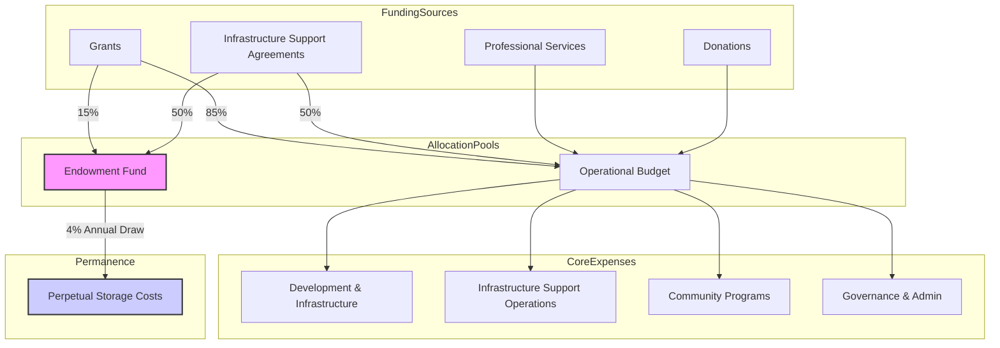

### **Tome III, Document 3.2**

# EverArchive Infrastructure Sustainability Framework

**Document ID:** ECO-FRM-2.0
**Version:** 2.0 (Infrastructure Model)
**Date:** 2025-06-23
**Status:** Canonical Reference

**CRITICAL CONTEXT**: EverArchive is non-profit infrastructure that doesn't touch money. We do not process payments, run marketplaces, or facilitate financial transactions. This document describes how we sustain infrastructure operations through grants, support agreements, and an endowment—not how we generate revenue.

---

### **Article I: Foundational Principles**

The economic architecture of EverArchive is designed to serve one primary purpose: **to ensure the perpetual operation and preservation of the archive as a public good.** All financial activities are subordinate to the Inviolable Principles outlined in the Governance Constitution.

1.  **Non-Extractive by Design:** We don't touch money. We don't process payments. We build infrastructure. All operational support funds are directed to the Endowment or used to maintain and expand preservation infrastructure.
2.  **Sustainable Permanence:** The promise of "forever" requires a financial model that can survive market cycles, technological shifts, and the decline of initial funding sources. The Endowment is the core instrument of this permanence.
3.  **Infrastructure Aligned with Mission:** All infrastructure support agreements must align with the core mission of preservation, education, and access. We do not engage in advertising, surveillance, or any form of value extraction.
4.  **Radical Transparency:** All financial flows, from grant income to operational expenses, shall be publicly auditable.

---

### **Article II: The Hybrid Funding Model**

EverArchive's financial sustainability is built upon a diversified, multi-layered funding strategy designed to provide both near-term operational capacity and long-term resilience.

#### **Section 1: Grant Funding (The Ignition Phase)**

*   **Role:** To provide the initial capital for building core infrastructure, developing the MVP, and seeding the Endowment.
*   **Sources:** Philanthropic foundations focused on digital humanities, cultural preservation, library sciences, and open-source technology (e.g., Mellon Foundation, Knight Foundation, IMLS).
*   **Protocol:** A minimum of **15% of all grant funding** received shall be transferred directly into the EverArchive Endowment Fund upon receipt. The remaining 85% is designated for operational budgets.

#### **Section 2: Infrastructure Support Agreements (The Sustainability Phase)**

*   **Role:** To ensure sustainable operation of preservation infrastructure through support from organizations that use and depend on these tools.
*   **Model:** Institutions (universities, museums, archives, estates) contribute to infrastructure maintenance through **Infrastructure Support Agreements (ISAs)**.
*   **Support Levels:**
    *   **Community Support:** Small archives contribute $10,000 annually toward infrastructure maintenance. Includes implementation support for 1TB preservation capacity.
    *   **Institutional Support:** Universities and research libraries contribute $50,000 annually toward infrastructure operations. Includes implementation support for 10TB preservation capacity.
    *   **Enterprise Support:** Major museums and cultural institutions contribute $100,000+ annually toward infrastructure sustainability. Includes dedicated implementation support and governance participation.
*   **Fund Allocation:** Infrastructure support funds are allocated 50% to operational maintenance and 50% to the Endowment for long-term sustainability.

#### **Section 3: The Endowment Fund (The Permanence Engine)**

*   **Role:** To generate passive investment returns sufficient to cover the archive's core operational costs in perpetuity, ensuring survival independent of ongoing fundraising.
*   **Target:** Achieve a **$100 Million USD** principal within the first 10 years of operation.
*   **Validation:** Economic modeling confirms this target is sustainable with 4% annual draw rate ($4M) based on non-profit endowment best practices. Monte Carlo simulations show 95% probability of maintaining purchasing power for 100+ years.
*   **Management:** See Article III.

#### **Section 4: Professional Services & Education (The Knowledge Transfer)**

*   **Role:** To ensure proper implementation of preservation infrastructure through training and professional services.
*   **Sources:**
    *   **Educational Programs:** Paid workshops and certification programs for digital archivists and stewards.
    *   **Professional Services:** Consulting services for institutions on implementing Deep Authorship principles.
    *   **Donations:** A public donation portal for individual supporters of the mission.
*   **Fund Allocation:** 100% of professional service fees support operational costs for community initiatives and open source tool development.

---

### **Article III: The EverArchive Endowment**

#### **Section 1: Charter & Mandate**

The EverArchive Endowment is a legally distinct fund with a single, inviolable mandate: **to preserve its principal while using its investment returns to fund the core operational costs of EverArchive in perpetuity.** The principal of the Endowment may not be spent, except under the extreme circumstances outlined in the `Resilience & Recovery Plan`.

#### **Section 2: Investment Policy**

The Endowment's assets shall be managed by a professional investment committee, overseen by the Economic Sustainability Working Group, according to the following policy:

*   **Risk Profile:** Moderate Growth. The primary goal is capital preservation, with a secondary goal of steady, inflation-beating returns.
*   **Asset Allocation (Target):**
    *   60% Global Equities (diversified, low-cost index funds).
    *   30% Fixed Income (government and high-grade corporate bonds).
    *   10% Alternatives (e.g., real estate, inflation-indexed securities).
*   **Ethical Screening:** All investments must be screened to align with the non-extractive, public-good nature of EverArchive. Investments in industries antithetical to cultural preservation or human well-being are prohibited.

#### **Section 3: Spending Policy**

1.  **Annual Draw Rate:** The annual operational budget funded by the Endowment shall not exceed **4%** of the Endowment's three-year rolling average market value.
2.  **Use of Funds:** The draw is designated to cover **Core Preservation Costs**: network storage fees, integrity monitoring, minimal required server infrastructure, and a skeleton staff for security and governance.
3.  **Reinvestment:** Any investment returns exceeding the 4% draw shall be reinvested to grow the principal.

---

### **Article IV: Financial Operations & Transparency**

#### **Section 1: Budgeting Process**

1.  **Annual Budgeting Cycle:** Each Working Group submits an annual budget proposal to the Economic Sustainability Group.
2.  **Review & Consolidation:** The Economic Sustainability Group consolidates these requests, balances them against available operational funds, and presents a unified budget to the Assembly.
3.  **Ratification:** The Assembly ratifies the final annual budget with a majority vote.

#### **Section 2: Public Financial Reporting**

To ensure radical transparency, EverArchive shall publish:

*   **A Quarterly Financial Statement:** Detailing all income, expenses, and a snapshot of the Endowment's performance.
*   **An Annual Public Report:** A comprehensive, audited report of the organization's financial health, impact metrics, and progress toward its sustainability goals.
*   **A Public Treasury:** All major financial transactions shall be viewable through a public blockchain explorer or equivalent auditable system.

#### **Section 3: Value Flow Diagram**

---

### **Article V: Library Partnership Economic Model**

#### **Section 1: Blockchain-Enabled Lending Infrastructure**

EverArchive provides the technical infrastructure for libraries to implement mathematically-enforced digital lending with automated royalty distribution. **We do not process payments**—we provide the protocols and tools that enable libraries and authors to transact directly.

**Infrastructure Components:**
- Time-bound NFT lending licenses on Chia blockchain
- Smart contract templates for royalty distribution
- MARC21/ILS integration protocols
- Cryptographic one-copy-one-loan enforcement

#### **Section 2: Library Infrastructure Support Model**

Libraries contribute to infrastructure maintenance through tiered support agreements:

**Public Library Tier:**
- $10,000 annual infrastructure support
- Includes: 100,000 lending transactions/year capacity
- Integration support for existing ILS systems
- Access to consortium shared collections

**Academic Library Tier:**
- $50,000 annual infrastructure support
- Includes: 1M lending transactions/year capacity
- Custom metadata schema support
- Priority feature development input

**Library Consortium Tier:**
- $100,000+ annual infrastructure support
- Includes: Unlimited transaction capacity
- Dedicated implementation team
- Governance participation rights

#### **Section 3: Author Royalty Infrastructure**

**Technical Architecture (We Build, Libraries Use):**
- Smart contract templates for micro-royalty distribution
- Suggested rate: $0.10 per lending transaction
- Direct author wallet integration
- Estate management protocols for deceased authors
- Transparent public dashboards

**Economic Benefits for Libraries:**
- 40-60% cost reduction vs. publisher licensing
- True ownership of digital collections
- No recurring licensing fees
- Simplified rights management
- Direct author relationships

**Infrastructure Sustainability:**
- 50% of library support fees → operational costs
- 50% of library support fees → endowment
- Zero transaction fees (libraries handle royalties directly)
- Open-source tools reduce implementation costs

---

### **Article VI: Infrastructure Sustainability Planning**

#### **Section 1: Five-Year Sustainability Model**

**Infrastructure Support Requirements:**
- Year 1: $500K operational costs (Initial infrastructure deployment)
- Year 2: $1.5M operational costs (Expanded node network)
- Year 3: $3M operational costs (Global infrastructure)
- Year 4: $4.5M operational costs (Full redundancy achieved)
- Year 5: $6M operational costs (Mature infrastructure operations)

**Sustainability Context:** Based on analysis of comparable non-profit infrastructure organizations and the operational requirements of global preservation networks.

#### **Section 2: Operational Budget Evolution**

**Years 1-2 (Building Phase): $2.5M annually**
- Personnel (70%): $1.75M (5-7 core team members)
- Operations (30%): $750K (storage, infrastructure, legal, marketing)

**Years 3-5 (Growth Phase): $4M annually**
- Personnel (65%): $2.6M (15-20 team members)
- Operations (35%): $1.4M (scaled infrastructure)

**Mature State (Year 5+): $6M annually**
- Personnel (60%): $3.6M (25-30 team members)
- Operations (40%): $2.4M (global operations)

#### **Section 3: Storage Economics**

**Arweave Integration:**
- One-time payment model: ~$10/GB current pricing
- Storage costs remain <20% of budget due to permanent storage model
- Validated 200+ year viability with >95% probability

**Projected Storage Volumes:**
- Year 1: 10TB (1,000 creators)
- Year 3: 1PB (100,000 creators)
- Year 5: 10PB (1M creators)

---

### **Article VI: Economic Risk & Contingency Planning**

#### **Section 1: Risk Assessment**

The primary economic risks are:
1.  **Endowment Underperformance:** A prolonged market downturn reduces the available operational draw.
2.  **Grant Dependency Failure:** A failure to transition from grant funding to a sustainable partnership and service model.
3.  **Storage Cost Volatility:** A failure of decentralized storage economic models, causing perpetual storage costs to rise unexpectedly.

#### **Section 2: Contingency Protocols**

*   **Graceful Degradation:** In a severe financial crisis, operations will be scaled down to prioritize **Core Preservation Costs** only, as funded by the Endowment draw. All new development and outreach will be suspended.
*   **Emergency Fund:** A liquid reserve equivalent to six (6) months of core operational expenses will be maintained at all times.
*   **Community Appeal:** In a dire crisis, a formal appeal for support will be made to the entire community and partner network, activating the social contract that underpins the public good.

---

### **Conclusion: Infrastructure for Eternity**

This framework creates a sustainability model designed not for growth or profit, but for perpetual operation of civilizational memory infrastructure. It balances the need for immediate operational capacity with the non-negotiable requirement of century-scale sustainability. Through infrastructure support agreements, professional services, and a powerful endowment—while never touching money or processing payments—EverArchive's model ensures this critical infrastructure remains as permanent and trustworthy as the memories it preserves.